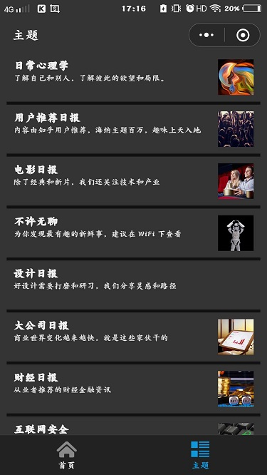
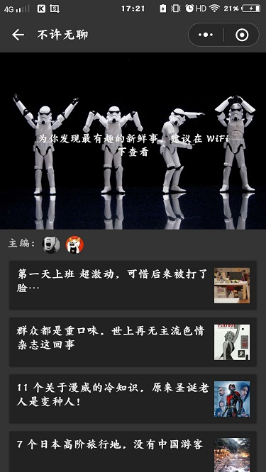
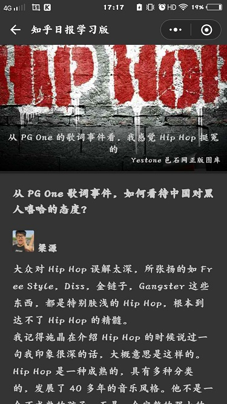

## 微信小程序之知乎日报
---
仅作小程序开发学习,不涉及商用

### 目标功能
- [X]主页
    - 轮播图 : \<swiper\>
    - 内容长列表: \<scroll-view>
    - 下拉无限加载 : bindscrolltolower
- [X]主题列表
- [X]主题详情
- [X]文章阅读
    - wxParse处理HTML片段

### API WIKI 
[知乎日报API](https://github.com/amumu233/zhihuDaily/wiki)

### 项目预览
#### 代码地址[github](https://github.com/amumu233/WeappZhihuDaily)
#### screenshots
- 主页    

- 主题列表    

- 主题详情     

- 文章阅读    

